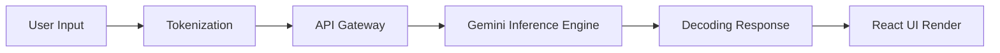

# Access.AI Assistant - Technical Overview

Welcome to **Access.AI Assistant**, a next-generation conversational interface powered by Google's Gemini Pro/Flash models. This project demonstrates a production-ready integration of Large Language Models (LLMs) with a modern React frontend, featuring real-time architectural visualization.

## 🧠 System Architecture

The application follows a **Client-Side AI Integration** pattern where the React frontend communicates directly with the Google Gemini API.



### The 5-Step Pipeline
Every message sent through Access.AI goes through this precise journey:

1.  **Input Capture**: The user's text and optional image (multimodal input) are captured by the `ChatComponent`.
2.  **Tokenization**: The raw text is broken down into "tokens" (vector representations of words/sub-words). This is the fundamental unit of information for the LLM.
    *   *Visualization*: You will see the "Tokenization" node light up first.
3.  **Secure Transport (API Gateway)**: The tokenized request is sent via HTTPS to Google's servers using the `@google/generative-ai` SDK.
4.  **Inference (Thinking)**: The Gemini model processes the input context (up to 1M+ tokens) to predict the most likely response tokens.
    *   *Visualization*: The Brain icon pulses purple during this phase.
5.  **Decoding & Rendering**: The returned tokens are converted back into human-readable text and rendered as Markdown in the chat interface.

## 🧠 How Gemini "Understands" Data (Vector Embeddings)
To make sense of your words, Gemini uses a concept called **Vector Embeddings**.

1.  **Words to Numbers**: Every word (or token) is converted into a long list of numbers called a "vector" (e.g., `[0.1, -0.5, 0.8...]`).
2.  **Semantic High-Dimensional Space**: These vectors exist in a multi-dimensional space (think of a map with thousands of dimensions, not just X, Y, Z).
3.  **Meaning by Proximity**:
    *   The vector for "King" is mathematically close to "Queen".
    *   The vector for "Apple" is close to "Fruit".
    *   The vector for "Apple" + "Technology" is close to "MacBook".
    
**Inference Process**:
When you ask a question, Gemini calculates the most probable *next vector* based on the patterns it learned during training. It doesn't "think" like a human; it mathematically predicts the best continuation of your vector path.

## 💻 Integration Code

The core logic lives in `src/hooks/useChatbot.ts`. Here is how we connect React to Gemini:

### 1. Initialization
Values are securely loaded from environment variables.
```typescript
import { GoogleGenerativeAI } from "@google/generative-ai";

const genAI = new GoogleGenerativeAI(import.meta.env.VITE_GEMINI_API_KEY);
```

### 2. The Generation Loop
This function handles the entire lifecycle, including the artificial delays added for the demo visualization.

```typescript
const sendMessage = async (message: string, image?: string) => {
    // 1. Capture & Update UI
    const newMessages = [...messages, { text: message, sender: "user", image }];
    setMessages(newMessages);

    try {
        // 2. Simulate Tokenization Step
        setStatus("tokenizing");
        await new Promise(r => setTimeout(r, 800));

        // 3. Network Transport
        setStatus("sending");
        const model = genAI.getGenerativeModel({ model: "gemini-2.5-flash" });
        await new Promise(r => setTimeout(r, 800));

        // 4. Inference (Real API Call)
        setStatus("processing");
        
        // Prepare Multimodal Input
        const promptParts: any[] = [message];
        if (image) {
            promptParts.push({
                inlineData: {
                    data: image.split(",")[1], // Base64
                    mimeType: "image/jpeg",
                }
            });
        }

        const result = await model.generateContent(promptParts);
        const response = await result.response;
        const text = response.text();

        // 5. Decoding Step
        setStatus("receiving");
        await new Promise(r => setTimeout(r, 600));

        // Final Render
        setMessages([...newMessages, { text: text, sender: "bot" }]);
        setStatus("idle");
        
    } catch (error) {
        console.error("AI Error:", error);
        setStatus("idle");
    }
};
```

### 3. System Instructions (Context Control)
We use system instructions to strictly scope the AI's persona to React technology and education.

```typescript
      const systemInstruction = `You are a specialized AI assistant strictly focused on React technology education. 
      Your purpose is to help users learn, understand, and debug React concepts, code, and ecosystem topics (like Redux, React Router, Next.js).
      RULES:
      1. You must ONLY answer questions related to React and frontend web development within the React context.
      2. If a user asks about anything else (e.g., general world knowledge, other programming languages unrelated to React, cooking, history, etc.), you must politely refuse.
      3. Your refusal message should be: "I am designed to assist only with React technology and related educational topics. Please ask me something about React!"`;

      const model = genAI.getGenerativeModel({
        model: "gemini-2.5-flash",
        systemInstruction: systemInstruction
      });
```

## 🚀 Key Features
*   **Multimodal**: Drag & drop images to chat about them.
*   **Real-time Viz**: Watch the AI "think" step-by-step.
*   **Tablet Layout**: Optimized for reading long code blocks.
*   **Secure**: API keys managed via `.env`.

---
*Built with React, TypeScript, Tailwind CSS, and Google Gemini.*
